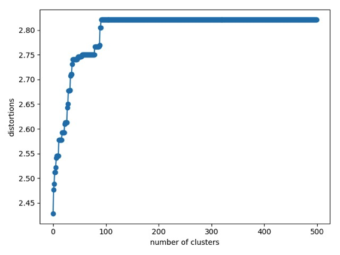
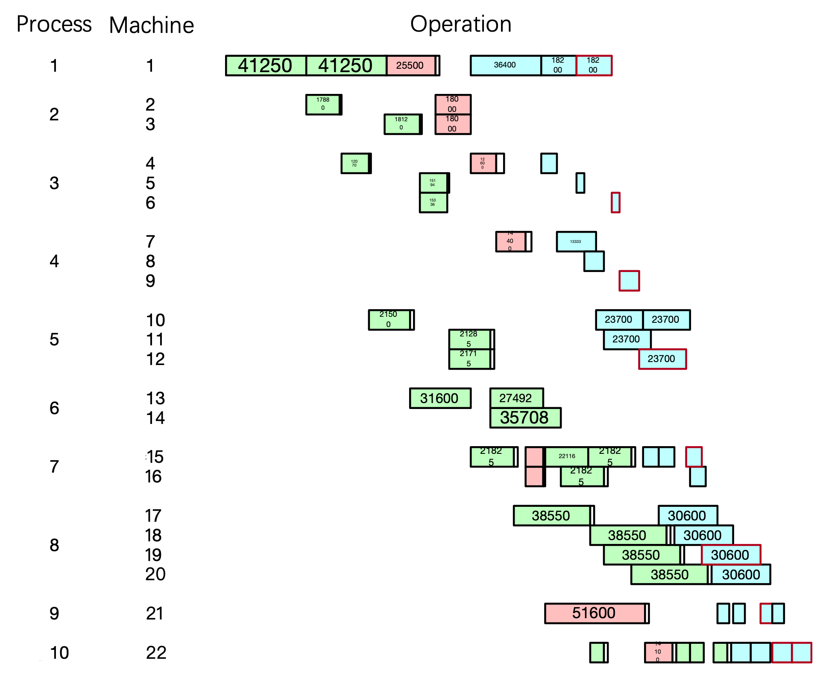
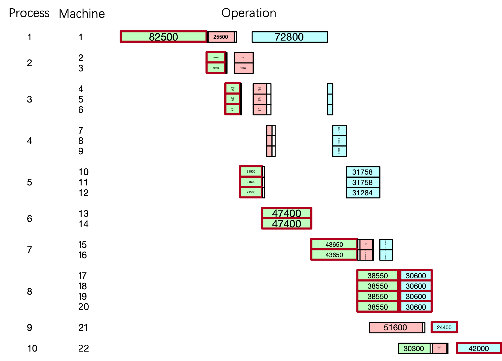
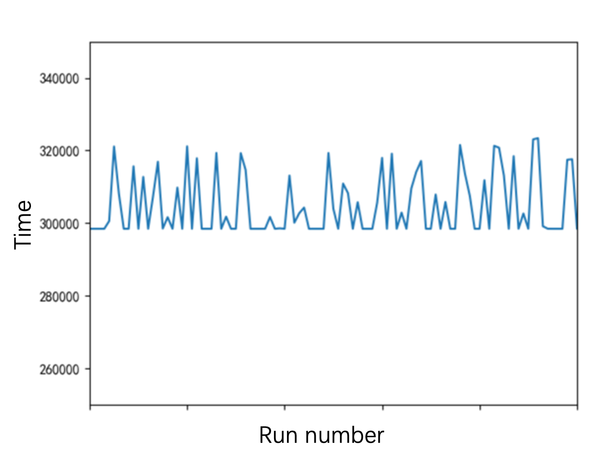

# Introduction

With the increasingly fierce market competition, the profits of the traditional manufacturing industry gradually decrease. The old crude manufacturing mode is no longer suitable. More and more enterprises began to pay attention to the efficiency of production and management. 

As a critical factor affecting production efficiency, proper scheduling can shorten the manufacturing period and reduce inventory. Especially as the flexibility and complexity of manufacturing increase, the batch scheduling, which divides workpieces into several sub-batches, could make full use of limited resources, improve equipment utilization rate, shorten the maximum completion time and reduce total energy consumption.

# Problem

This project considers an actual batch scheduling problem where the workpieces arrive randomly. 

This study aims to find the scheduling scheme that minimizes the completion time $C_{max}$ of all workpieces, including: 

- the batch number 
- the number of workpieces in each batch
- the processing order on each machine

## Layout

The workshop consists of 10 stations, and each of them contains at least one machine. The parallel stations, which have two or more identical machines, are the key to optimization. The layout of this workshop is:

## Parameters 

There are three different types of workpieces ($J_1-J_3$), the processing time for a workpiece on each machine ($M_1-M_{10}$) is (units: seconds):  

|          | $J_1$ | $J_2$ | $J_3$ |
| :------: | :---: | :---: | :---: |
|  $M_1$   |  275  |  170  |  364  |
|  $M_2$   |  120  |  240  |   0   |
|  $M_3$   |  142  |  84   |  78   |
|  $M_4$   |   0   |  96   |  199  |
|  $M_5$   |  215  |   0   |  474  |
|  $M_6$   |  316  |   0   |   0   |
|  $M_7$   |  291  |  158  |  122  |
|  $M_8$   |  514  |   0   |  612  |
|  $M_9$   |   0   |  344  |  122  |
| $M_{10}$ |  101  |  94   |  210  |

The total number and minimum batch for each kind of workpiece are:

| $J_1$ | $J_2$ | $J_3$ | minimum batch $S$ |
| :---: | :---: | :---: | ----------------- |
|  300  |  150  |  200  | 50                |

The setup time is (units: 1000 seconds):  

|       |         $J_1$         |         $J_2$         |         $J_3$         |
| :---: | :-------------------: | :-------------------: | :-------------------: |
| $J_1$ |           0           | (1,1,1,0,0,0,2,0,0,2) | (1,0,1,0,2,0,1,2,0,2) |
| $J_2$ | (2,1,1,0,0,0,1,0,0,2) |           0           | (2,0,4,3,0,0,1,0,2,1) |
| $J_3$ | (2,0,1,0,1,0,2,3,0,1) | (2,0,3,4,0,0,3,0,1,2) |           0           |

 The arrival time of $J_1$   is denoted as $AT_i$, and $AT_i \sim U(E_i, L_i)$:

|       | $E_i$  | $L_i$  |
| :---: | :----: | :----: |
| $J_1$ |   0    |   0    |
| $J_2$ |   0    | 50000  |
| $J_3$ | 100000 | 150000 |

## Known Variable

|  Variable  |                          Definition                          |
| :--------: | :----------------------------------------------------------: |
|    $N$     |               The number of workpieces’ types                |
|   $J_i$    |                        Workpiece $i$                         |
|   $BS_i$   |               The batch size of workpiece $i$                |
|   $R_i$    |              The arrival time of workpiece $i$               |
|    $S$     |                      Minimum batch size                      |
|    $M$     |                 The total number of machines                 |
|   $M_l$    |                         Machine $l$                          |
|   $n_i$    |      The number of processes required for workpiece $i$      |
|   $dn_i$   |     The number of processes completed when rescheduling      |
| $WT_{ijl}$ | The process time for the process $j$ of workpiece $i$ on machine $l$ |
| $PT_{ijl}$ | The setup time for the process $j$ of workpiece $i$ on machine $l$ |

## Decision Variable

|        Variable         |                          Definition                          |
| :---------------------: | :----------------------------------------------------------: |
|        $b_{ij}$         |     The batch number of workpiece $i$ in the process $j$     |
|       $BN_{ijk}$        |  The batch $k$’s size of  workpiece $i$ in the process $j$   |
|     $\phi _{ijkl}$      |  0-1 variable, represents the result of machine allocation   |
| $\delta _{ijk\_i'j'k'}$ |          0-1 variable, represents the process order          |
|    $\varphi _{ijkl}$    |         0-1 variable, represents the setup operation         |
|       $SPT_{ijk}$       | The start time of batch $k$’s setup operation for workpiece $i$ in the process $j$ |
|       $CPT_{ijk}$       | The end time of batch $k$’s setup operation for workpiece $i$ in the process $j$ |
|       $SWT_{ijk}$       | The start time of batch $k$’s operation for workpiece $i$ in the process $j$ |
|       $CWT_{ijk}$       | The end time of batch $k$’s operation for workpiece $i$ in the process $j$ |
|     $CT_{ij}(num)$      |   The time of $num$ workpieces $i$ to complet process $j$    |

# Model

$$
m i n \: Z = C _ { m a x }\\
C _ { m a x } = \max_{ 1 \leq i \leq N } \lbrace \max _{1 \leq k \leq b _ { in_i }}  {C W T _ { i n _ { i } k} }\rbrace
$$

$$
\sum _ { k = 1 } ^ { b_{ij} } B N _ { ijk } = B S _ { i }, \, \forall i, j \quad B N _ { ijk } \in Z ,\, \forall  i , j , k\\
B N _ { i j k } \geq S ,\, \forall i , j , k  
$$

$$
\sum\limits _ { l = 1 } ^ { M } \phi _ { ijkl } = 1 , \, \forall i ,j, k  \\
\sum\limits _ { l = 1 } ^ { M } ( \phi _ { ijkl} \times WT _ { ijl } ) > 0 , \, \forall i , j , k  
$$

$$
S W T _ { ijk} \geq C T _ { i (j-1)} ( \sum\limits _ { k' = 1 } ^ { k } BN _ { ij k'}) , \, \forall i , k \, \forall j > 1  \\
S W T _ { i  ( d n _ { i } + 1 ) l} \geq R _ { i }\, \forall i  
$$

$$
S P T _ { ijk} \geq C W T _ { i'j'k'} \times \delta _ { i' j ' k'\_ i j k} \times \sum\limits _ { l = 1 } ^ { M } ( \phi _{i jkl} \times \phi _{i'j'k'l}), \; \forall i,j, k,i',j',k'\\
S P T _ { ijk } \geq \lbrack S W T _ { i' j' k' } + B N _ { i' j' k'  } \times \sum\limits _ { i = 1 } ^ { M } (\phi _{i'j'k'l} \times WT_ { i ' j' l} ) \times \delta _ { i' j ' k'\_ i j k} \times \sum\limits _ { l = 1 } ^ { M } ( \phi _ { ijkl} \times \phi _{i'j'k'l} ) 
$$

$$
C P T _ { ijk } = S P T _ {  ijk  } + \sum\limits _ { l = 1 } ^ { M } ( P T _ { ij1 } \times \phi _ { ijkl } \times \varphi _ { i j k l} ) , \; \forall  i , j , k  \\
S W T _ { i j k } = C P T _ { ijk },\; \forall i, j , k  \\
C W T _ { ijk} = S W T _ { ijk} + B N _ { ijk } \times \sum\limits _ { l = 1 } ^ { M } ( \phi _ { ij  k l } \times WT_{ijl} ) , \; \forall i , j ,k
$$

$$
i,i'=1,2,\cdots,N \\
k=1,2,\cdots,b_{ij}\\
k'=1,2,\cdots,b_{i'j'}\\
j=\left({dn}_i+1\right),\left({dn}_i+2\right),\cdots,n_i\\
j'=\left({dn}_i+1\right),\left({dn}_i+2\right),\cdots,n_{i'}
$$

# Memetic Algorithm

| Notation |    Definition     |
| :------: | :---------------: |
|   $h$    |  The individual   |
|  $x_h$   |  The batch queue  |
|  $y_h$   | The process queue |

## Encoding

$$
x_h= | x_{h,1({dn}_1+1),1}\ x_{h,1({dn}_1+1),2}\ \cdots\ x_{h,1({dn}_1+1),b_{1({dn}_1+1)}}\ |\cdots| x_{h,1n_1,1}\ x_{h,1n_1,2}\ \cdots\ x_{h,1n_1,b_{1n_1}} | \cdots 
\\
 |x_{h,N\left({dn}_N+1\right),1}\ x_{h,N\left({dn}_N+1\right),2}\ \cdots\ x_{h,N\left({dn}_N+1\right),b_{N\left({dn}_N+1\right)}} \left|\cdots\right|\ x_{h,Nn_N,1}\ x_{h,Nn_N,2}\ \cdots\ x_{h,Nn_N,b_{Nn_N}}|
$$

$$
y_h=|y_{h,1({dn}_1+1),1}\ y_{h,1({dn}_1+1),2}\ \cdots\ y_{h,1({dn}_1+1),b_{1({dn}_1+1)}}\ |\cdots|y_{h,1n_1,1}\ y_{h,1n_1,2}\ \cdots\ y_{h,1n_1,b_{1n_1}}|\cdots
\\
|y_{h,N({dn}_N+1),1}\ y_{h,N({dn}_N+1),2}\ \cdots\ y_{h,N({dn}_N+1),b_{N({dn}_N+1)}} |\cdots|\ y_{h,Nn_N,1}\ y_{h,Nn_N,2}\ \cdots\ y_{h,Nn_N,b_{Nn_N}}|
$$

## Decoding

1. $m=1$

2. Get the corresponding $i, j,k$ from the batch $m$ on the $y_h$, get the ${BN}_{ijk}$ on the $x_h$. 

   If ${BN}_{ijk}=0$, then this batch is invalid, and go step 5; otherwise, go step 3.

3. If $j>{dn}_i+1$, then calculate the time for $\sum_{k'=1}^{k}{BN}_{ijk'}$ workpieced $i$ to complet process $j-1$.

4. Select the machine that can complete batch $k$’s setup and process operation for workpiece $i$ in the process $j$ first.

5. $m=m+1$.

   If $m \leq L$, then go step 2; otherwise, end the decoding.

## Fitness

$$
max\ f=\frac{1}{Z}
$$

## Global Search

$$
\Omega=\frac{D_t}{D_{max}}\\
D_t=\frac{1}{N_p}\times\sum_{h=1}^{N_p}\left(f_h^t-\bar{f^t}\right)^2\\
D_{max}=max{D_{t^\prime},t^\prime=0,1,\cdots,t}
$$

$$
CR=\begin{cases}
CR_{0} & t=0\\
CR_{0}\times2^{1-\beta\times\Omega} & t>0
\end{cases}
$$

### For $x_h$

1. Claculate $\Omega$ and $CR$.

   $h=1$.

2. Get the random natural numbers $h_1, h_2, h_3 \in [1,N_p]$ where  $h_1 \neq h_2 \neq h_3 \neq h$.

   Get the random natural number $r_1 \in [1,N]$.

   $i=1$.

   Get the random natural number $r_2 \in [1,n_i]$.

   $j={dn}_i+1$.

3. If $i=r_1$ & $j=r_2$, the go step 4; otherwise, go step 5.

4. $$
   x_{h,ij,k}^\prime=\left[x_{h_1,ij,k}^t+F_{ij}\times\left(x_{h_2,ij,k}^t-x_{h_3,ij,k}^t\right)\right],\ k=1,2,\cdots,b_{ij}
   \\
   F_{ij}\geq m a x{\left\{0,\max_{1\le k\le b_{ij}}{\left\{min{\left\{\frac{{BS}_i-x_{h_1,ij,k}^t}{x_{h_2,ij,k}^t-x_{h_3,ij,k}^t},\frac{-x_{h_1,ij,k}^t}{x_{h_2,ij,k}^t-x_{h_3,ij,k}^t}\right\}}\right\}}\right\}}
   \\
   F_{ij}\le m i n{\left\{2,\min_{1\le k\le b_{ij}}{\left\{max{\left\{\frac{{BS}_i-x_{h_1,ij,k}^t}{x_{h_2,ij,k}^t-x_{h_3,ij,k}^t},\frac{-x_{h_1,ij,k}^t}{x_{h_2,ij,k}^t-x_{h_3,ij,k}^t}\right\}}\right\}}\right\}}
   $$

5. Get the random number $r_3 \in [0,1]$.

   If $r_3\le CR$, then go step 4; otherwise, let the $\left|x_{h,ij,1}\ x_{h,ij,2}\ \cdots\ x_{h,ij,b_{ij}}\right| \in x_h^t$ join the $x_h'$, and go step 6.

6. $j=j+1$.

   If $j\le n_i$, then go step 3; otherwise, go step 7.

7. $i=i+1$.

   If $i\le N$, then go step 3; otherwise, end the evolution.

### For $y_h$

8. Make two random pairs between the process queue in the current population, for each pair:

9. Get the random natural number $i \in [1,N]$, and $j \in [1, n_i]$.

   Denote a pair of parent queues is $y_{h_4}^t$ and  $y_{h_5}^t$, find the smallest queue block that contains all the batches of workpiece $i$ in the process $j$.

10. Swap the blocks found in  $y_{h_4}^t$ and  $y_{h_5}^t$ to get  $y_{h_4}'$ and  $y_{h_5}'$.

11. Modify the   $y_{h_4}'$ and  $y_{h_5}'$, and put them in temporary population.

### Roulette

$$
p_h=\frac{f_h}{\sum_{h=1}^{2\times N_p}f_h}
$$

## Local Search

1. Get the random natural number $d \in [1,L]$, and get the batch $d$’s $i,j,k$ on $y_h$.

   Get the random natural number $r \in [0,1]$.

   $x=x_h$, $y=y_h$.

2. If $r=1$, then go step 3; otherwise:

   1. If $j>{dn}_i+1$, denote the batch $b_{i(j-1)}$’s location of workpiece $i$ in the process $j-1$ on $y$ as $d_1$; otherwise $d_1=0$.

   2. If the $(d-1)$’s batch on $y$ belongs workpiece $i$ in the process $j$, then swap the ${BN}_{ijk}\ $ and ${BN}_{ij(k-1)}$ on $x$;

      $k=k-1$, go step 5.

   3. If the $(d-1)$’s batch on $y$ belongs workpiece $i$ but not in the process $j$, then go step 6.

   4. If the $(d-1)$’s batch on $y$ does not belong workpiece $i$, then swap the batches on location $d$ and $d-1$.

   5. If $f(x\&y)>f(x_h\&y_h)$, then $x_h=x,y_h=y$.

   6. $d=d-1$.

      If $d>d_1+1$, then go step 2; otherwise, end the local search. 

3. :

   1. If $j<n_i$,  denote the first batch’s location of workpiece $i$ in the process $j+1$ on $y$ as $d_2$; otherwise $d_2=L+1$.

   2. If the $(d+1)$’s batch on $y$ belongs workpiece $i$ in the process $j$, then swap the ${BN}_{ijk}\ $ and ${BN}_{ij(k+1)}$ on $x$;

      $k=k+1$, go step 5.

   3. If the $(d+1)$’s batch on $y$ belongs workpiece $i$ but not in the process $j$, then go step 6.

   4. If the $(d-1)$’s batch on $y$ does not belong workpiece $i$, then swap the batches on location $d$ and $d+1$.

   5. If $f(x\&y)>f(x_h\&y_h)$, then $x_h=x,y_h=y$.

   6. $d=d+1$.

      If $d<d_2-1$, then go step 2; otherwise, end the local search. 

# Result

## Convergence

## Operation

# Simulation

## Benchmark

364800 seconds:

## Comparation

305051 seconds (average):

## Performance

Save processing time: **16.4%**

