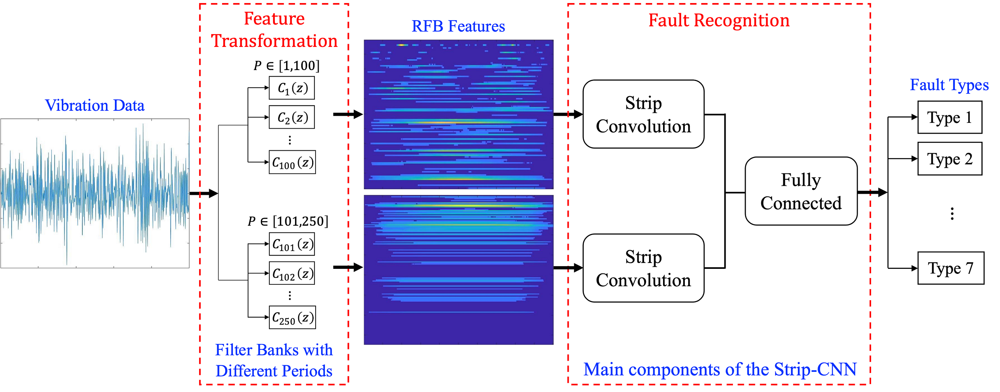

# Introduction

Bearing fault diagnosis plays an essential role in the maintenance of rotating machines in industries. Challenges posed in developing an effective and robust bearing fault diagnosis method include the essential complexity of vibration data and the external interference caused by the data collection. 

# Methodology

This study develops an intelligent data-driven method for bearing fault diagnosis in noisy environments, consisting of the feature transformation of vibration data and fault recognition based on transformed features:

Firstly, an extension of the Ramanujan filter banks (RFB) method, Scaled-RFB, is introduced to suppress the noises and convert original time series vibration data into representative RGB images. Next, a strip convolutional neural network (Strip-CNN) is developed with strip convolution to recognize the health condition of bearings based on the obtained RGB images. The illustration of Strip convolution:

# Case Studies

## Datasets

Two vibration datasets collected from Soochow University and Case Western Reserve University are utilized to validate the effectiveness and robustness of the proposed method individually. 

The dataset of Soochow University:

| Health Types | Fault Width (mm) | Location of Bearing Faults |
| :----------: | :--------------: | :------------------------: |
|      1       |       0.2        |             IR             |
|      2       |       0.2        |             IR             |
|      3       |       0.2        |             BA             |
|      4       |       0.6        |             BA             |
|      5       |       0.6        |             OR             |
|      6       |       0.6        |             OR             |
|      7       |       N.A.       |             No             |

The dataset of  Case Western Reserve University:

| Health Types | Dataset number | Fault width (mm) | Location of Bearing Faults | Locations of Bearings |
| :----------: | :------------: | :--------------: | :------------------------: | :-------------------: |
|      1       |      3001      |       0.72       |             IR             |          DE           |
|      2       |      118       |       0.18       |             BA             |          DE           |
|      3       |      197       |       0.36       |        OR centered         |          DE           |
|      4       |      290       |       0.36       |             BA             |          FE           |
|      5       |      298       |       0.18       |       OR orthogonal        |          FE           |
|      6       |      302       |       0.18       |        OR opposite         |          FE           |
|      7       |       97       |       N.A.       |           Normal           |         N.A.          |

## Noises

Six levels of Gaussian noises are separately added into the two datasets to further demonstrate the performance of the proposed method in noisy environments. Values of the SNR and the corresponding energy of six groups of synthesized noisy datasets are $[10,3,0,-3,-7,-10]$ dB and $[0.1,0.5,1,2,5,10]$ times of the original signal respectively.

## Benchmarks

Six state-of-art deep learning algorithms with the feature transformation via STFT are considered benchmarking algorithms in this study, including the AlexNet, GoogLeNet, ResNet-18, SqueezeNet, ShuffleNet, and EfficientNet. Compared with six benchmarking methods, the proposed method can achieve the best performance on bearing fault diagnosis in most scenarios and shows promising performance on datasets with a higher noise level. 

When the signal-noise ratio (SNR) is $-10$ dB, the average Precision, Recall, and F1 scores of the proposed method on both datasets are at least $51.79$%, $52.49$%, and $52.47$% higher than benchmarking methods, respectively.

