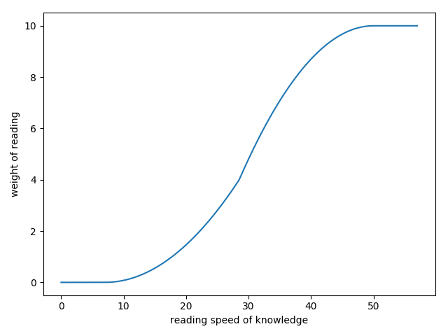
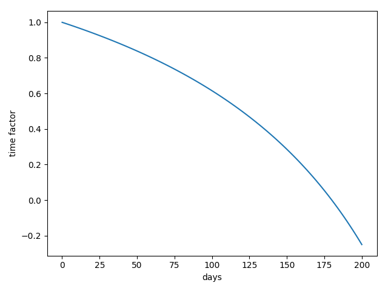
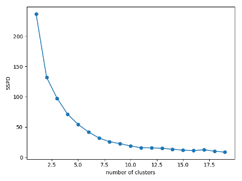
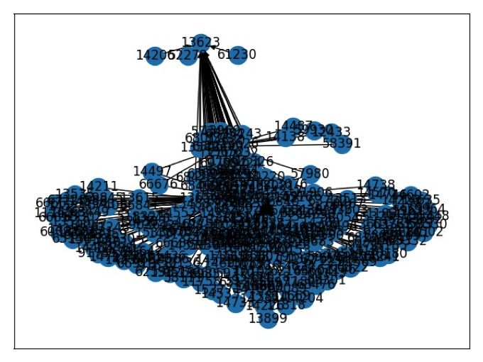
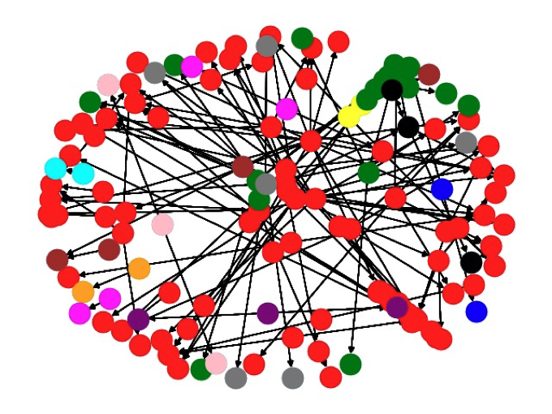

Firstly, this paper analyses the six kinds of behavioral characteristics generated by users around knowledge in the "E-Think Tank" system, including "uploading, collecting, commenting, praising, reading" and "searching". Considering the attenuation of preference over time, the "user-knowledge preference model" and the "user-keyword preference model" are established, so the user's preferences are described from two levels, and it's expressed as a vector space model. Then, Pearson Distance is used to improve the binary K-Means algorithm to cluster the user's preference, whose score is 1.36 times the clustering results of Euclidean Distance when measured by the Silhouette Coefficient; and based on the user's four kinds of interactive behaviors around the knowledge in the "E-Think Tank" system, including "collecting, commenting, praising, reading", a directed weighted interactive relationship network is constructed. Aiming at maximising the modularity, the improved GN algorithm is used to discover the communities in the network. So the clustering results and community discovering results of the user group are obtained. Then, a hybrid push algorithm consisting of "user-based collaborative push", "content-based push" and "hotspot-based push" is applied to realise intelligent push of knowledge. Finally, the research content of this article is programmed by Python and MySQL, with an interactive interface with "E-Think Tank" system.

# Introduction

SAIC Volkswagen Automotive Co., Ltd. is developing an intelligent knowledge management system called "E-Think Tank".  This system is designed to enhance employees' efficiency and improve the enterprise's competitiveness by improving automobile R&D knowledge dissemination. 

Based on the system, this project studies the intelligent push of knowledge, including identifying the user's individual needs, upgrading the "passive search" of knowledge to "active push", and pushing the knowledge that the user most likely needs to the homepage after landing. The intelligent push of knowledge could reduce acquiring knowledge, shorten retrieval time, and improve user experience.

Thus, this project has three stages: 

- **user preference description**: the user preference model is established from two levels
- **user group division**: the user group is divided from two angles
- **knowledge intelligent push**: the results from three kinds of push algorithms are mixed to realize the intelligent push of knowledge

# User Preference Description

The user preference model is to describes the user's personalized knowledge preferences to achieve personalized push. The granularity of modeling can be divided into the "user-knowledge preference model" and "user-keyword preference model". 

In this project, the user preference model is programmed by a vector space model. By fixing the position of feature items, the model could be converted into the matrix form, which could improve the reading and writing efficiency in the database.

## User-knowledge Preference Model

This project analyses five user behaviors in the "E-Think Tank" system, including the upload, collect, comment, praise, and read. Combined with the calculation rules of "points" and "experience level" in the "E-Think Tank" system, the user's preference weight for knowledge reflected by different behaviors is given. 

However, the preference weight of "read" is not fixed. This weight is calculated by comparing the "reading speed" of knowledge with the user's historical average value. And the mapping function is fitted with a piecewise quadratic function:

This project considers the attenuation of preference weight over time and uses the negative power function to fit it. Since the "E-Think Tank" system is serving R&D work, and SAIC Volkswagen's work cycle is almost half a year, this curve could be obtained:

## User-keyword Preference Model

Using the knowledge tag obtained by another team member, the "user-keyword preference model" is established based on the "user-knowledge preference model". The granularity describing the user preference is refined from the knowledge object to the knowledge content. 

However, the user's "search" behavior in the "E-Think Tank" system is generated around keywords, reflecting their preference. Therefore, this project conducts the semantic analysis of the user's "search" behavior, taking the user's search history as "knowledge".

The keywords and corresponding weight information can be obtained by using the TF-IDF algorithm. So the user's preference for keywords is derived from the other perspective, and the "user-keyword preference model" is improved.

# User Group Division

The user group division is to discover the small group naturally formed outside the official "three-level department" structure due to the actual work content to realize the intelligent pushing of knowledge. 

This project achieves the user group division from the two perspectives, including "similarity" and "relevance", reflected in their preference for knowledge and interaction within the system, respectively.

## Similarity-based Division

This project uses the binary K-Means algorithm to cluster the preference vectors obtained by the user-knowledge preference model. During the clustering, the default Euclidean distance is replaced with the Pearson distance to measure the similarity of the data. The Sum of the Squared Pearson Distance (SSPD) is used to measure the quality of clustering instead of the Sum of the Squared Error (SSE). When measured by the Silhouette Coefficient, the score of Pearson Distance's result is 1.36 times the other one. 

To determine the optimal K value, the "elbow method" is adopted. For the test data of 280 users provided by SAIC Volkswagen, the optimal K value obtained is "8":

The result of group division is written into the database for subsequent operations. 

## Relevance-based Division

This project analyses the four interactive behaviors users generate around knowledge, including collect, comment, praise and read. According to the interaction data, a directed weight interaction network is constructed to describe the relationship between users. 

This project applies the modified GN algorithm to realize community discovery. For the test data, when the modularity takes the maximum value, 280 users are divided into one community:

 

The wrong number of communities was obtained because an administrator among normal users frequently interacts with others. After eliminating the outlier, the users are divided into eight communities:

# Knowledge Matching Push

The push algorithm is to achieve the match between users and knowledge. Based on the user preference model and user group division, this project considers the pros and cons of different algorithms. Finally, a hybrid push algorithm consisting of three algorithms are adopted, including "user-based collaborative push", "content-based push" and "hotspot-based push". The final result is obtained by mixing the results of three push algorithms. 

## User-based Collaborative Push

In addition to the text, SAIC Volkswagen has a considerable amount of knowledge stored in the "E-Think Tank" system in the form of pictures. It will also generate knowledge in audio, video, and other formats in the future. According to the various types of knowledge, the collaborative push algorithm was chosen based on the "user-knowledge preference model". 

At present, the "E-Think Tank" system has about 2,000 users and 16,000 pieces of knowledge, and the growth rate of knowledge is much higher than that of users, which means the number of knowledge is much larger than the number of users, so the "user-based collaborative push" is selected. 

Since groups are significantly different from each other, one user's nearest neighbors are only searched in its cluster and community, making the push more targeted. However, this may reduce the amount of knowledge being pushed. 

## Content-based Push

Since the collaborative push has the "cold start" problem, the content-based push is also realized. Based on the "user-keyword preference model" and knowledge tags, the content-based push expands the push services' scope by covering users with specific knowledge preferences. 

Since content-based push only compares the similarity between knowledge content and user's preferences, regardless of whether the user has a preference record for the knowledge, the amount of knowledge-pushed is more than the collaborative method.

## Hotspot-based Push

Finally, at the request of SAIC Volkswagen, the hotspot-based push in the group is realized according to the results of the user group division, which is more personalized than the current hotspot-based push in the department. 

Since the hotspot-based push has the lowest worst, it can provide the most push results. To ensure the quality of push, the number of hotspot-based knowledge pushes is limited to ten.

# Programming Language

The research content of this article is programmed by Python and MySQL, with an interactive interface with the "E-Think Tank" system.
