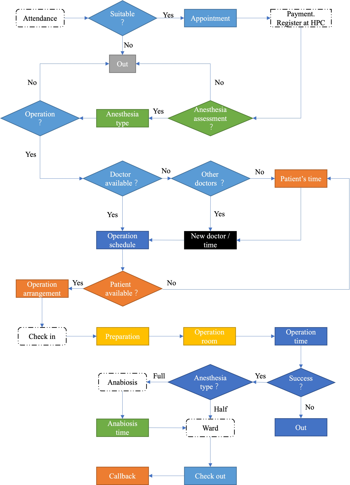

Based on the implementation status of the daily surgery in Ruijin Hospital and Renji Hospital, the standard process of lean daily surgery is proposed:

Day surgery has the characteristics of compact time and high dependence on anesthesia. And the green part is the anesthetist‘s job. It has higher requirements for resource allocation and surgical planning. Therefore, a management information system for day surgery is essential. 

# Introduction

This paper studies the design and implementation of the anesthesiologist port in the Lean Day Surgery Management Information System. 

First of all, according to different responsibilities, this article divides the anesthesiologist port into three sub-ports: **outpatient anesthesiologist, surgical anesthesiologist and anabiosis anesthesiologist**, and decomposes the functions that each port should realize. 

Then, according to the data required by the function, the MySQL is used to complete the design of the database.

Finally, the interface design and function implementation of the system was completed by Java, and the connection and interaction between MySQL and Java were realized through maven. 

The system can be operated not only in a single machine, but also through a database connected to the cloud to achieve network operation, which can meet the hospital's needs.

# Function 

## Basic

| Index |        Description        |          Reference          |            Input             |                            Output                            |
| :---: | :-----------------------: | :-------------------------: | :--------------------------: | :----------------------------------------------------------: |
|   1   |          log in           |     username; password      |      username; password      | operation interface (land successfully); "wrong username” (invalid username); "wrong password” (invalid password) |
|   2   | view personal information |                             | click “personal information” |                 user’s personal information                  |
|   3   |      change password      |        old password         |  old password; new password  | "change success” (right old password);  "change failure” (wrong old password); |
|   4   |      search patients      | patients’s part information |   patients’s name or index   |                  patients’s all information                  |

## Outpatient Anesthesiologist

| Index |                    Description                     |                   Reference                    |                            Input                             |                  Output                  |
| :---: | :------------------------------------------------: | :--------------------------------------------: | :----------------------------------------------------------: | :--------------------------------------: |
|   1   |            edit patients’s information             |       patient’s appointment information        |                                                              |          patients’s information          |
|   2   | input patients’s anesthesia assessment information |             patient’s information              | anesthesia assessment (success); anesthesia type (full/half); assessment time; assessment doctor (user) | delete the patient from the waiting list |
|   3   |                 delete the patient                 | patients’s anesthesia assessment result (fail) | anesthesia assessment result (fail); assessment time; assessment doctor (user) |    delete the patient from the system    |

## Surgical anesthesiologist

| Index |          Description           | Reference | Input |           Output           |
| :---: | :----------------------------: | :-------: | :---: | :------------------------: |
|   1   | view the operation information |           |       | the operation arrangements |

## Anabiosis anesthesiologist

| Index | Description                     | Reference         | Input                           | Output                                   |
| ----- | ------------------------------- | ----------------- | ------------------------------- | ---------------------------------------- |
| 1     | input patients’s anabiosis time | the present  time | patients’s anabiosis time; user | delete the patient from the waiting list |
| 2     | view patients’s anabiosis time  |                   |                                 | patients waiting for anabiosis           |

# Presentation 

## Outpatient Anesthesiologist

## Surgical anesthesiologist

## Anabiosis anesthesiologist

