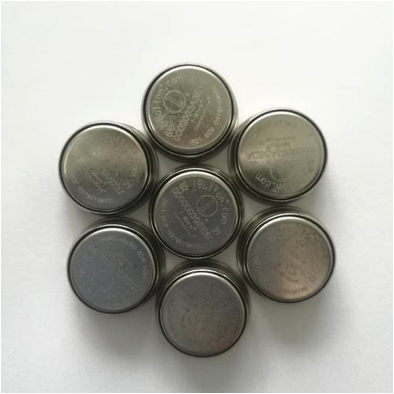
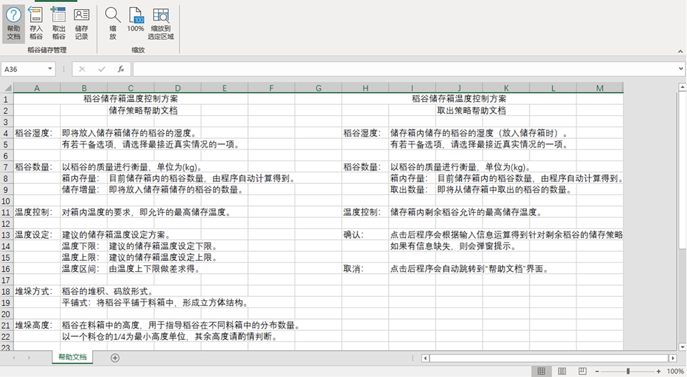

# Temperature Control Scheme Design of Rice Storage Tank

## Sampling Points

According to the Taguchi experimental design method, the 18 sampling points in the tank are selected for temperature measurement: 

## Equipment

Anemograph (Testo 405i):

Temperature and humidity sensor (DS1023):

## Process

1. Analyse the measurement data using:
   - Bartlett test
   - ANOVA
   - F test
   - Other statistical methods
2. Evaluate the cooling effect according to the statistical differences 
3. Obtain the temperature control scheme under the given conditions

## Programming

The research results are programmed with VBA, so it can be run using Microsoft Excel.

The software has been copyrighted.

# Study on The Influence of Stacking Mode on Rice Storage at Low Temperature

## Equipment

### Containers

### Incubator

### Sensors

## Parameters

17 stacking modes are obtained from the combination of 9 parameters:

|  Stacking   | Centralization |  Location  |  Distance  | Partition  |    Height     | Dispersion |
| :---------: | :------------: | :--------: | :--------: | :--------: | :-----------: | :--------: |
| centralized |                | $\bigcirc$ |            |            |               |            |
|  dimidiate  |                |            | $\bigcirc$ |            |               |            |
|  dimidiate  |                | $\bigcirc$ | $\bigcirc$ |            |               |            |
| centralized |   $\bigcirc$   | $\bigcirc$ |            |            |               |            |
|  dimidiate  |                |            |            | $\bigcirc$ |               |            |
|  dimidiate  |                |            | $\bigcirc$ |            |               |            |
|             |                | $\bigcirc$ |            |            |      low      | $\bigcirc$ |
|             |                |            |            |            |  $\bigcirc$   |            |
|             |                | $\bigcirc$ |            |            | extremely low | $\bigcirc$ |

## Process

1. Model the rice’s temperature change over time based on the data of 30 sensors
2. Measure temperature’s statistical differences:
   - Normality test
   - ANOVA
   - Fisher LSD
3. Obtain the cooling effect of rice under different parameter combinations

