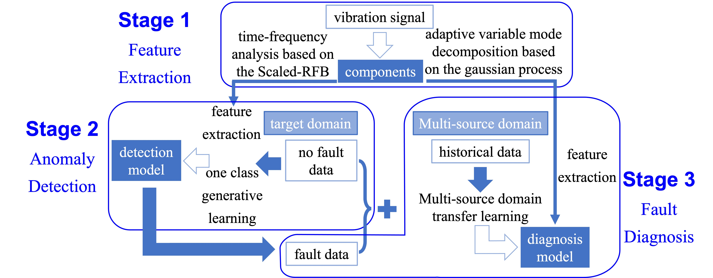

## Background

Critical mechanical equipment:

- variable operating conditions 
- high load

bearings easy to fail.

---

## Aim

Ensure the stable operation of equipment:

- detect and diagnose bearing failures

---

## Difficulty

- unclear relationship between the collected data and the fault:
  - interference of strong noise 
  - modulation of variable operating conditions

- the data in the fault state:
  - few 
  - even missing

---

## Framework



Therefore, there are three research stages:

- **signal feature component extraction**: extract feature component from vibration data to using time-frequency analysis and modal decomposition algorithm
- **abnormal detection**: train the abnormal detection model using the one-class generation learning algorithm
- **fault diagnosis**: train the diagnosis model using multi-source domain transfer learning

This project is still in progress. 


